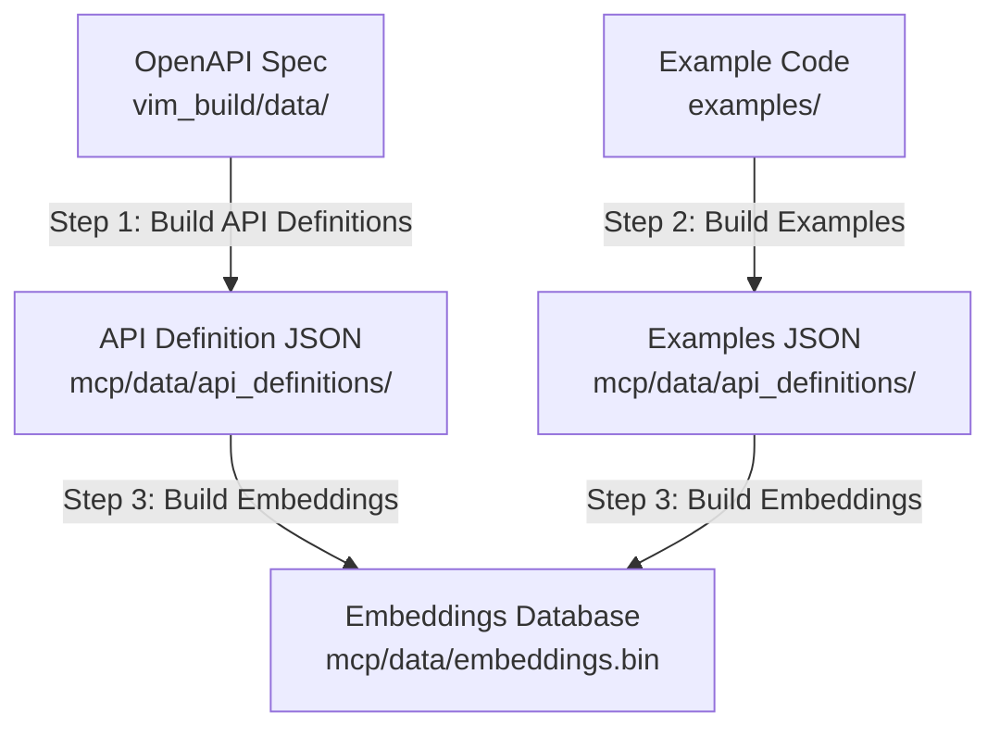
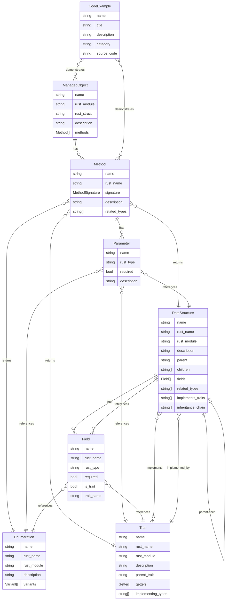

# Data Transformer

Orchestrator program that runs all data processing tools in sequence to transform vSphere API specifications and code examples into structured data for the vim_rs MCP server.

## Overview

The Data Transformer coordinates three processing steps that convert:
- OpenAPI specifications → API definition JSON files
- Code examples → indexed example JSON
- All structured data → vector embeddings database

## Workflow

The transformer executes the following steps in order:



### Step Details

1. **Build API Definitions** (`build_api_definitions`)
   - Transforms OpenAPI specification into structured JSON
   - Generates managed objects, methods, data structures, enumerations, and traits
   - Input: `vim_build/data/vi_json_openapi_specification_v9_0_0_0_24798170.json`
   - Output: `mcp/data/api_definitions/*.json` (multiple files)

2. **Build Examples** (`build_examples`)
   - Scans code examples directory and indexes them
   - Extracts metadata, descriptions, and categories
   - Input: `examples/**/*.rs`
   - Output: `mcp/data/api_definitions/examples.json`

3. **Build Embeddings** (`build_embeddings`)
   - Generates vector embeddings for all structured data
   - Creates searchable binary database
   - Input: All JSON files in `mcp/data/api_definitions/`
   - Output: `mcp/data/embeddings.bin`

## Usage

### Prerequisites

- Rust toolchain (stable)
- CUDA-capable GPU (optional, for faster embeddings generation)
- OpenAPI specification in `vim_build/data/`

### Running the Transformer

From the workspace root:

```bash
cargo run --bin data-transformer
```

Or from the `data_transformer` directory:

```bash
cargo run
```

The program will:
- Calculate paths relative to the workspace root automatically
- Execute each step sequentially
- Log progress and timing information to stderr
- Stop on first error with clear error messages

### Output

All output is written to `mcp/data/`:
- `mcp/data/api_definitions/` - All JSON definition files
- `mcp/data/embeddings.bin` - Vector embeddings database
- `mcp/data/model_cache/` - Cached ML models

## Dependencies

The transformer depends on all data processing tools:
- `build-api-definitions` - API definition generation
- `build-examples` - Example indexing
- `build-embeddings` - Embedding generation (with optional CUDA support)

## Error Handling

Each step is executed independently with error handling:
- If any step fails, the transformer stops immediately
- Clear error messages indicate which step failed
- Previous steps' outputs are preserved
- Partial runs can be resumed by running the transformer again

## Performance

The transformer logs timing information for each step:
- API definitions: Moderate, processes large OpenAPI spec
- Example indexing: Fast, scans Rust source files
- Embedding generation: Slowest step, benefits from CUDA acceleration

Total execution time varies but typically takes a few minutes for a complete run.

## Data Model

The transformer produces a structured data model that represents the vSphere API. The following diagram illustrates the relationships between different data entities:



### Entity Relationships

**Core API Entities:**

1. **Managed Objects** (e.g., `VirtualMachine`, `HostSystem`)
   - Contain multiple **Methods** that can be invoked
   - Represent vSphere managed entities

2. **Methods** (e.g., `PowerOnVM_Task`, `CreateVM`)
   - Belong to a **Managed Object**
   - Have **Parameters** that reference **Data Structures**, **Enumerations**, or **Traits**
   - Return **Data Structures**, **Enumerations**, or **Traits**
   - Track `related_types` for type discovery

3. **Data Structures** (e.g., `VirtualMachineConfigSpec`, `HostConfigInfo`)
   - Contain **Fields** that reference other types
   - Support inheritance: have `parent` and `children`
   - Implement **Traits** when they have child types (polymorphic)
   - Fields can reference **Traits** for polymorphic fields
   - Track `related_types` and `inheritance_chain`

4. **Traits** (e.g., `VirtualDeviceTrait`, `MethodFaultTrait`)
   - Represent polymorphic interfaces
   - Have multiple **Data Structures** that implement them
   - Provide getter methods for accessing common fields
   - Support trait inheritance via `parent_trait`

5. **Enumerations** (e.g., `VirtualMachinePowerState`, `TaskInfoState`)
   - Contain **Variants** with discriminator values
   - Used as field types and method parameters/returns

**Documentation & Examples:**

6. **Code Examples**
   - Demonstrative code snippets
   - Categorized by usage pattern (connection, property_collector, etc.)
   - Reference **Managed Objects** and **Methods** in source code

### Key Relationships

- **Method → Type References**: Methods connect to types through:
  - Parameter types (`signature.parameters[].rust_type`)
  - Return types (`signature.return_type`)
  - Related types (`related_types[]`)

- **Data Structure → Trait**: When a structure has child types, it implements a trait that provides a polymorphic interface. The trait lists all implementing types in `implementing_types[]`.

- **Field → Type References**: Fields reference types through:
  - Direct type (`rust_type`)
  - Trait type (`is_trait: true`, `trait_name`)

- **Inheritance**: Data structures form inheritance hierarchies via `parent`/`children` relationships, with `inheritance_chain` tracking the full path.

- **Cross-References**: The `related_types` arrays in Methods and Data Structures enable discovery of interconnected types.

This data model enables semantic search, type navigation, and intelligent code generation for the vSphere API.
