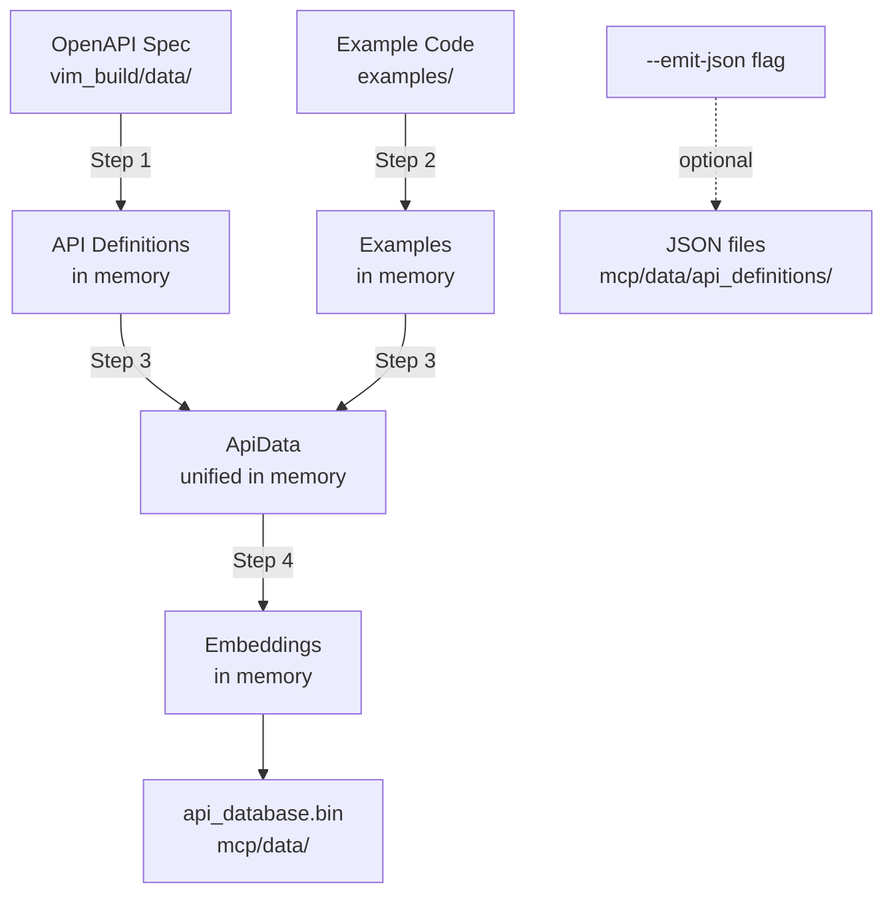
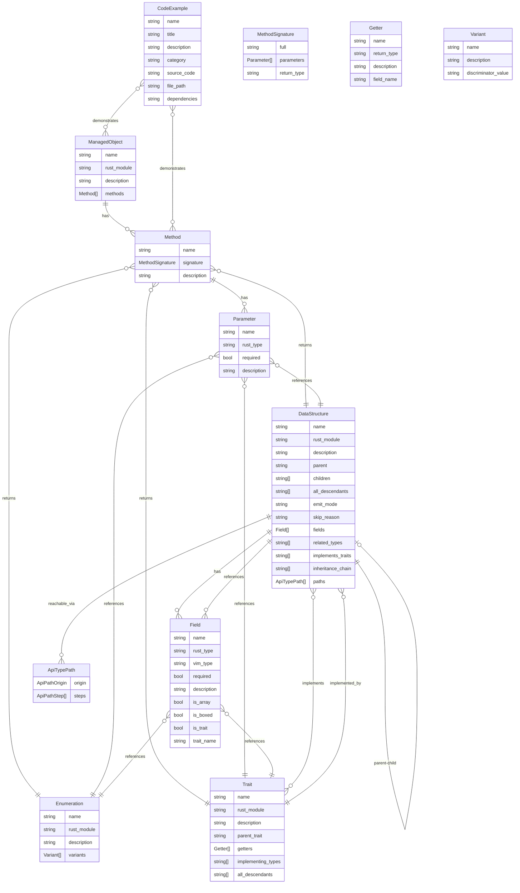

# Data Transformer

Orchestrator program that builds the unified API database for the vim_rs MCP server.

## Quick Start

```bash
cargo run --bin data-transformer
```

Outputs: `mcp/data/api_database.bin` (~60-70 MiB)

## Usage

### Basic Usage

From the workspace root:

```bash
cargo run --bin data-transformer
```

Or from the `data_transformer` directory:

```bash
cargo run
```

### With Debug JSON Output

To also emit JSON files for debugging:

```bash
cargo run --bin data-transformer -- --emit-json
```

This writes additional JSON files to `mcp/data/api_definitions/` alongside the binary database.

### With CUDA Acceleration

For faster embedding generation on NVIDIA GPUs:

```bash
cargo run --bin data-transformer --features cuda
```

## Workflow

The transformer executes four steps in-memory, then writes a single unified binary:



### Step Details

1. **Build API Definitions** (in-memory)
   - Parses OpenAPI specification
   - Generates managed objects, methods, data structures, enumerations, and traits
   - Input: `vim_build/data/vi_json_openapi_specification_v9_0_0_0_24798170.json`

2. **Collect Examples** (in-memory)
   - Scans code examples directory
   - Extracts metadata, descriptions, and categories
   - Input: `examples/**/*.rs`

3. **Construct ApiData**
   - Combines API definitions and examples into unified data structure
   - Prepares items for embedding generation

4. **Generate Embeddings**
   - Generates vector embeddings for all items using model selected in `mcp/server/src/lib.rs` (BGE-small-en)
   - Downloads and caches model in `mcp/data/model_cache/`

5. **Write Database**
   - Serializes everything into a single binary file
   - Output: `mcp/data/api_database.bin`

## Output

Primary output:
- `mcp/data/api_database.bin` - Unified binary database with all API data and embeddings

Optional output (with `--emit-json`):
- `mcp/data/api_definitions/` - JSON definition files for debugging

Cached artifacts:
- `mcp/data/model_cache/` - Cached ML models for embedding generation

## Prerequisites

- Rust toolchain (stable)
- CUDA-capable GPU (optional, for faster embeddings via `--features cuda`)
- OpenAPI specification in `vim_build/data/`
- Example code in `examples/`

## Dependencies

The transformer uses these internal libraries:
- `build-api-definitions` - API definition extraction from OpenAPI spec
- `build-examples` - Example code indexing
- `build-embeddings` - Vector embedding generation (with optional CUDA support)
- `api_database` - Shared types for the unified database format

## Error Handling

- If any step fails, the transformer stops immediately with a clear error
- Previous runs' outputs are preserved (not deleted on failure)
- Partial runs can be resumed by running the transformer again

## Data Model

The transformer produces a structured data model representing the vSphere API. All types are defined in `mcp/api_database/src/lib.rs`.



### Entity Descriptions

**Core API Entities:**

1. **Managed Objects** (e.g., `VirtualMachine`, `HostSystem`)
   - Contain multiple **Methods** that can be invoked
   - Represent vSphere managed entities

2. **Methods** (e.g., `power_on_vm_task`, `create_vm_task`)
   - Belong to a **Managed Object**
   - Have **Parameters** that reference **Data Structures**, **Enumerations**, or **Traits**
   - Return **Data Structures**, **Enumerations**, or **Traits**

3. **Data Structures** (e.g., `VirtualMachineConfigSpec`, `HostConfigInfo`)
   - Contain **Fields** that reference other types
   - Support inheritance: have `parent`, `children`, and `all_descendants`
   - Define a **Trait** when they have child types (polymorphic)
   - Implement **Traits** inherited from their parents
   - Include **Paths** showing how to reach this type from API entry points
   - Track `related_types` and `inheritance_chain`

4. **Traits** (e.g., `VirtualDeviceTrait`, `MethodFaultTrait`)
   - Represent polymorphic interfaces
   - Have multiple **Data Structures** that implement them (`implementing_types`)
   - Provide **Getter** methods for accessing common fields
   - Support trait inheritance via `parent_trait`
   - Track `all_descendants` for full hierarchy

5. **Enumerations** (e.g., `VirtualMachinePowerState`, `TaskInfoState`)
   - Contain **Variants** with discriminator values
   - Used as field types and method parameters/returns

6. **ApiTypePath** - Navigation paths from API entry points to types
   - **Origin**: Starting point (PropertyAccessor, MethodOutput, or MethodInput)
   - **Steps**: Navigation sequence (Field access, Downcast)
   - Rendered as shorthand: `VirtualMachine::config?.hardware.device[*]→VirtualEthernetCard`

**Documentation & Examples:**

7. **Code Examples**
   - Demonstrative code snippets with full source
   - Categorized by usage pattern (connection, property_collector, etc.)
   - Include `file_path` and `dependencies` for reproducibility

### Key Relationships

- **Method → Type References**: Methods connect to types through:
  - Parameter types (`signature.parameters[].rust_type`)
  - Return types (`signature.return_type`)

- **Data Structure → Trait**: When a structure has child types, it defines a trait that provides a polymorphic interface. The trait is implemented by all children. See `implementing_types[]`.

- **Field → Type References**: Fields reference types through:
  - Direct type (`rust_type` / `vim_type`)
  - Trait type (`is_trait: true`, `trait_name`)
  - Array and boxing metadata (`is_array`, `is_boxed`)

- **Inheritance**: Data structures form inheritance hierarchies via `parent`/`children`/`all_descendants` relationships, with `inheritance_chain` tracking the full path to root.

- **Navigation Paths**: `paths` on structures show how to reach them from managed object properties or method inputs/outputs, enabling the MCP server to provide "how to access" guidance.

This data model enables semantic search, type navigation, and intelligent code generation for the vSphere API.
