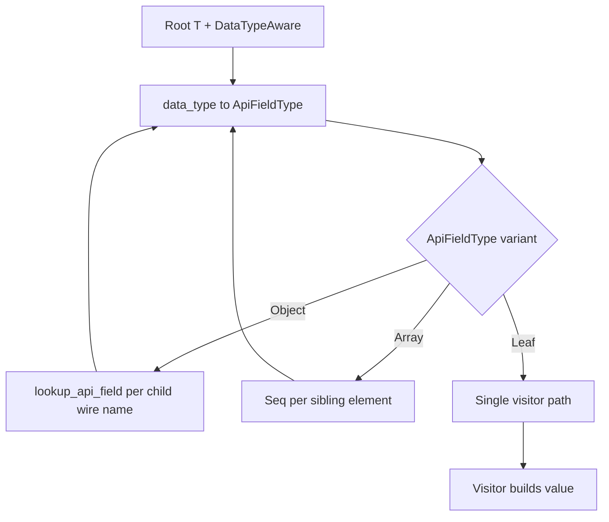

# Data model (conceptual): Metadata-guided XML deserialization

**Feature**: [spec.md](./spec.md)  
**Date**: 2026-05-09

This describes **logical** entities for planning and tests—not a database schema.

## Entities

### ApiFieldType

Declared shape of a value in the VIM API model: primitives (`Str`, integers, `Binary`, …), **`Object(StructType)`**, **`Array(&'static ApiFieldType)`**, **`Any`**, enums as string-like fields, etc. Produced by codegen into **`api_field_registry`** and used by the XML driver at **every** descent step.

**Relationships**:

- **StructType** — indexes **`lookup_api_field(st, field_wire_name)`** for object children.
- **Wire element** — child tag selects field; inner type drives nested descent.

### StructType

Discriminant for concrete VIM structs and inheritance roots. Used to load field metadata and validate **`xsi:type`** refinements (**`child_of(base)`**).

### Root deserialization context

- **Rust type `T`** at entry point (generic parameter).
- **`T::data_type()`** → root **`ApiFieldType`** (`DataTypeAware`).
- **Byte stream** positioned at the payload element after SOAP handling.

### XML node (streaming)

Current element: **local name**, **attributes** (`xsi:type`, `xsi:nil`, `@…`), **text**, **child elements**. The driver does not retain a full DOM; only cursor state + declared type stack. At completion (**FR-014**, **SC-003**), interpretation **never** branches on “try visitor A then B” or structural seq-vs-single probing—only on declared **`ApiFieldType`** and **`lookup_xml_type`** outcomes.

### Type refinement (xsi:type)

Optional narrowing of a declared base:

- **`Any`** — **`xsi:type` mandatory**; resolve via **`lookup_xml_type`**.
- **`Object(base)`** — optional subtype; must be inheritance-compatible with **`base`**.
- **Primitive** — if present, must match declared primitive alias rules.

### `lookup_xml_type` resolution buckets

Logical buckets for a wire type **local name** (see [research.md](./research.md) R9–R11 and **FR-010–FR-013**):

| Order | Bucket | Typical resolution |
|------:|--------|-------------------|
| 1 | **Struct** | **`StructType::from_str`** — descend as **`Object(st)`** with normal field map |
| 2 | **Boxed value wrapper** | **`lookup_any_value_wrapper`** (PHF / static map) — **`_typeName` + `_value`** topology when under **`Any`** |
| 3 | **XSD primitive** | **`lookup_xml_primitive`** — scalar or boxed primitive topology per context |

**Out of scope for this table**: standalone enum names (**not** accepted as **`xsi:type`** via a separate enum table). Field-site **`Array`** vs **`ArrayOf*`** under **`Any`** is a **parent declared type** distinction, not a fourth bucket in **`lookup_xml_type`**.

### Sequence (array) assembly

For **`ApiFieldType::Array(inner)`**, sibling elements → **`Seq`** visitor; each item deserialized as **`inner`**. Duplicate field-name policy: **LWW** across runs (see [research.md](./research.md) R4).

### Failure context (non-error)

Not part of the public **`Result`**: optional **log** records (path, declared type, safe wire excerpt) under **`vim_rs::wire::soap`** (or documented target).

## Validation split

| Concern | Layer |
|--------|--------|
| Shape vs **`ApiFieldType`** | XML driver |
| Required fields, **`Option`**, enum membership | miniserde generated builders (same as JSON) |
| Cross-field invariants | Not expanded in this feature |

## Diagram (descent)

